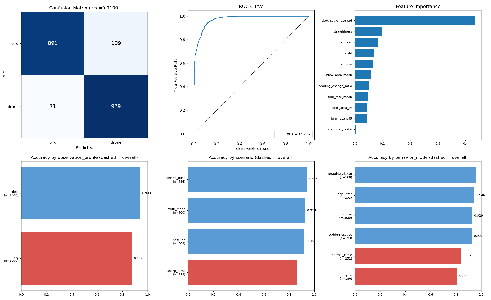

# RF 분류기 성능 평가

Part C의 RandomForest bird/drone 분류기에 대한 학습·평가 절차와 확정 지표를 기록한다.

## 실행 방법

```bash
# 학습 (전체 train 데이터로 학습 후 models/rf_classifier.pkl 저장)
python -m ai_server.services.train

# 평가 (train 학습 → test 홀드아웃 평가, reports/ 에 결과 저장)
python -m ai_server.services.evaluate

# 확정본을 docs/ 로 승격 (발표·공유용으로 결과가 확정됐을 때만)
python -m ai_server.services.evaluate --publish
```

주요 옵션:

| 옵션 | 기본값 | 설명 |
|---|---|---|
| `--train-path` | `data/train_features.csv` | 학습 CSV 경로 |
| `--test-path` | `data/test_features.csv` | 테스트 CSV 경로 |
| `--report-dir` | `reports/` | 리포트 저장 위치 |
| `--n-estimators` | `100` | 트리 개수 |
| `--publish` | off | 확정본을 `docs/` 로 승격 |

### 산출물 관리 방식

`reports/`는 실행할 때마다 덮어쓰는 **작업 산출물**이라 git 추적에서 제외한다.
파라미터를 바꿔가며 여러 번 돌려도 저장소 히스토리가 더러워지지 않는다.

결과가 확정되면 `--publish`로 `docs/`에 승격한다. 이때만 저장소에 기록된다.

| 대상 | 경로 | git |
|---|---|---|
| 매 실행 산출물 | `reports/report.png`, `reports/metrics.json` | 추적 안 함 |
| 확정 그래프 | `docs/images/rf_evaluation.png` | 추적 |
| 확정 지표 | `docs/rf_metrics.json` | 추적 |

`rf_metrics.json`은 텍스트라 재학습 시 커밋 diff로 성능 변화가 그대로 드러난다.
성능 회귀를 별도 도구 없이 히스토리에서 추적할 수 있다.

## 평가 결과 요약



윗줄은 전반 성능(혼동행렬 / ROC / 피처 중요도), 아랫줄은 세그먼트별 정확도 분해다.
아랫줄에서 점선은 전체 정확도(0.9100)이고, **붉은 막대는 전체 평균을 밑도는 취약 구간**이다.

## 데이터셋

파일명은 `train_features.csv` / `test_features.csv`로 **고정**하고, 버전은 파일명이 아니라
데이터 안의 컬럼으로 추적한다. 학습·평가 시 아래 값이 모델 번들과 리포트에 자동 기록된다.

| 항목 | 값 |
|---|---|
| `simulator_version` | `4.0.0` |
| `feature_version` | `3.0.0` |
| `feature_config_id` | `3b9a6c638c3f3519` |

| 항목 | train | validation | test |
|---|---|---|---|
| 샘플 수 | 6,000 | 2,000 | 2,000 |
| 라벨 | bird 3,000 / drone 3,000 | bird 1,000 / drone 1,000 | bird 1,000 / drone 1,000 |
| `family_id` 수 | 652 | — | 217 |

B파트가 validation 분할을 추가로 제공해 3분할이 됐다. 아래 확정 지표는 test 기준이며,
validation은 동일 모델로 0.9000이 나와 test(0.9100)와 1%p 안에서 일치한다.

**누수 검증** — 세 분할 모두 `family_id` 교집합 0, `sample_id` 교집합 0, 동일 피처 행 0.
패밀리 단위로 분리되어 있어 같은 궤적 계열이 train/test 양쪽에 걸치지 않는다.
이 검사는 `evaluate.py`가 실행할 때마다 수행해 `metrics.json`에 기록한다.

## 피처 (11종)

`v_mean`, `v_std`, `a_mean`, `turn_rate_mean`, `turn_rate_p95`, `heading_change_ratio`,
`straightness`, `stationary_ratio`, `bbox_area_mean`, `bbox_area_cv`, `bbox_scale_rate_std`

목록은 `ai_server/services/train.py`의 `FEATURE_NAMES`가 단일 진실 공급원이며,
`evaluate.py`가 이를 참조하므로 피처가 바뀌어도 평가 스크립트는 수정할 필요가 없다.

## 하이퍼파라미터 선정

테스트셋 성능으로 설정을 고르면 테스트셋에 과적합되므로, **train 내부
`GroupKFold(family_id)` 교차검증**으로 선정한 뒤 테스트셋은 최종 확인에만 사용했다.

> **주의:** 아래 탐색 표의 CV 수치는 시뮬레이터 v3 데이터셋에서 측정한 값이다.
> 데이터가 시뮬레이터 v4로 교체된 뒤 재탐색하지 않았으므로, 절대값이 아니라
> 후보 간 상대 비교 근거로만 읽어야 한다. 선정된 설정 자체는 v4에서도 유지했다.

| 설정 | CV f1_macro | 모델 크기 |
|---|---|---|
| `n=100` | 0.8053 | 3.5 MB |
| `n=300` | 0.8093 | 10.6 MB |
| `n=300, min_samples_leaf=5` | 0.8059 | 6.7 MB |
| **`n=100, min_samples_leaf=5`** | **0.8033** | **2.2 MB** |
| `n=300, min_samples_leaf=20` | 0.7934 | 2.8 MB |
| `n=300, max_features=None` | 0.8090 | — |
| `n=300, max_depth=10` | — (test 0.7604) | — |

상위 후보들의 CV 차이는 0.006 이내로, 폴드 간 표준편차(±0.011)보다 작아
**통계적으로 구분되지 않는다.** 성능이 동등하다면 저장소 히스토리에 부담이 적은 쪽이
낫다고 판단해 모델 파일이 가장 작은 조합을 택했다.

- `max_features=None`은 테스트셋에서 0.8110으로 가장 높았지만 CV에서는 재현되지 않았고
  분산만 커져(±0.0162) 테스트셋 노이즈로 판단해 채택하지 않았다.
- `max_depth` 제한은 모든 조합에서 성능이 뚜렷하게 떨어져 기본값을 유지한다.
- 압축 없이 저장하면 트리 300개 기준 50MB에 달한다. `joblib.dump(compress=3)`을 적용해
  최종 모델은 2.2MB다.

**확정: `n_estimators=100`, `min_samples_leaf=5`, `random_state=42`, 나머지 sklearn 기본값**

## 확정 지표

### 홀드아웃 테스트셋 (n=2,000)

| 지표 | 값 |
|---|---|
| accuracy | **0.9100** |
| F1 (macro) | **0.9100** |
| ROC-AUC | 0.9727 |
| PR-AUC | 0.9721 |

| 클래스 | precision | recall | f1-score | support |
|---|---|---|---|---|
| bird | 0.9262 | 0.8910 | 0.9083 | 1,000 |
| drone | 0.8950 | 0.9290 | 0.9117 | 1,000 |

drone recall이 0.7670에서 **0.9290**으로 올랐다. 시뮬레이터 v4가 조류에 날갯짓 변조를
도입하면서 두 클래스가 분리된 결과다. 미탐 비용이 큰 탐지 목적에서 가장 의미 있는 변화다.

### Confusion Matrix

|  | pred bird | pred drone |
|---|---|---|
| **true bird** | 891 | 109 |
| **true drone** | 71 | 929 |

### 교차검증 (train, GroupKFold 5-fold)

f1_macro **0.8985 ± 0.0091** — folds: 0.8958 / 0.9124 / 0.9042 / 0.8941 / 0.8858

test(0.9100), validation(0.9000), CV(0.8985) 세 추정치가 1.2%p 안에 모여 과적합 징후가 없다.

### Feature Importance

| 피처 | 중요도 | 이전(시뮬레이터 v3) |
|---|---|---|
| `bbox_scale_rate_std` | **0.4352** | 0.1267 |
| `straightness` | 0.0974 | 0.0921 |
| `a_mean` | 0.0834 | 0.1460 |
| `v_std` | 0.0692 | 0.0613 |
| `v_mean` | 0.0676 | 0.1024 |
| `bbox_area_mean` | 0.0576 | 0.1164 |
| `heading_change_ratio` | 0.0519 | 0.0381 |
| `turn_rate_mean` | 0.0467 | 0.1136 |
| `bbox_area_cv` | 0.0425 | 0.0628 |
| `turn_rate_p95` | 0.0423 | 0.1020 |
| `stationary_ratio` | 0.0062 | 0.0385 |

이전에는 0.038~0.146 범위에 고르게 분포했으나, **`bbox_scale_rate_std` 하나가 43.5%로
쏠렸다.** 시뮬레이터 v4가 조류에 날갯짓 변조(pigeon 8.3Hz, falcon 5Hz, seagull 4Hz,
고정익 드론 0Hz)를 도입하면서 이 피처가 날갯짓 탐지기 역할을 하게 됐다.

성능 향상의 대부분이 이 채널에서 나왔지만, **동시에 가장 큰 취약점이기도 하다.**
아래 「알려진 취약점」을 참고한다.

## 세그먼트별 정확도

### observation_profile — 노이즈 강건성

| 구분 | n | accuracy |
|---|---|---|
| ideal | 1,000 | 0.9430 |
| noisy | 1,000 | 0.8770 |

노이즈 조건에서 **6.6%p 하락**한다. Sim2Real 관점에서 실측 환경 성능의 하한으로 볼 수 있다.

### scenario — 취약 시나리오

| 구분 | n | accuracy |
|---|---|---|
| sudden_dash | 494 | 0.9372 |
| multi_mode | 500 | 0.9280 |
| baseline | 508 | 0.9154 |
| sharp_turns | 498 | 0.8594 |

급격한 방향 전환(`sharp_turns`)만 상대적으로 취약하게 남았다. `sudden_dash`는 이전
0.7753에서 0.9372로 올라 더 이상 병목이 아니다.

### behavior_mode

| 구분 | n | accuracy |
|---|---|---|
| foraging_zigzag | 168 | 0.9583 |
| flap_jitter | 202 | 0.9455 |
| cruise | 1,000 | 0.9290 |
| sudden_escape | 193 | 0.9275 |
| thermal_circle | 251 | 0.8367 |
| glide | 186 | 0.8065 |

병목이 완전히 뒤바뀌었다. 이전 최대 약점이던 `cruise`(0.7670 → 0.9290)와
`sudden_escape`(0.7345 → 0.9275)가 해소된 반면, **`glide`(0.8065)와
`thermal_circle`(0.8367)이 새 병목**이 됐다.

두 모드는 `SIMULATION_V4.md` 기준 **추진력 0인 활공**이라 날갯짓이 없다. 고정익 드론도
날갯짓이 없어, 두 클래스가 물리적으로 같은 방식으로 난다. 실제로 `bbox_scale_rate_std`
분포를 보면 활공 조류(평균 0.16)가 드론(0.11)과 거의 겹치고, 날갯짓하는 조류(1.09)와는
크게 다르다.

드론 서브타입별로 보면 같은 구조가 드러난다.

| 서브타입 | accuracy |
|---|---|
| racing_quad | 0.9600 |
| hover_quad | 0.8480 |
| consumer_quad | 0.7200 |
| **fixed_wing_drone** | **0.5280** |

`fixed_wing_drone`은 사실상 동전 던지기 수준이다. **활공 조류 ↔ 고정익 드론**이
남은 오류의 집중 지점이다.

### training_length_group

| 구분 | n | accuracy |
|---|---|---|
| short | 168 | 0.9226 |
| standard | 1,832 | 0.9088 |

트랙 길이에 따른 유의미한 성능 차이는 관찰되지 않는다.

## 알려진 취약점 — 지표 해석 시 반드시 함께 읽을 것

### 단일 피처 의존과 관측 잡음 취약성

`bbox_scale_rate_std`가 중요도의 43.5%를 차지한다. 이 값은 bbox 면적 변화율의 표준편차,
즉 날갯짓이 bbox를 흔드는 정도다.

검출기·추적기가 만드는 bbox 지터를 이 피처에 주입해 민감도를 측정했다.

| 추가 지터 | accuracy | drone recall | bird recall |
|---|---|---|---|
| 0.00 (현재) | 0.910 | 0.929 | 0.891 |
| 0.05 | 0.750 | **0.557** | 0.944 |
| 0.10 | 0.684 | **0.408** | 0.960 |
| 0.20 | 0.629 | 0.282 | 0.976 |

**작은 지터에도 무너지고, 무너지는 방향이 나쁘다.** 모델이 "bbox가 흔들리면 새"로
학습했기 때문에 지터가 끼면 드론을 새로 오인한다. 대드론 시스템에서 가장 치명적인
방향의 오류다. bird recall이 오히려 올라가는 것이 그 증거다.

`research/SIMULATION_V4.md`도 이 채널의 현실성이 검증되지 않았다고 명시한다.

> 현재 bbox는 여전히 투영 실루엣 근사와 A-like ROI 관측 모델이다. 날개 자세·가림·motion
> blur를 렌더링하고 A 추적기에 실제 통과시킨 결과가 아니다. 따라서 bbox 기반 특징의
> 현실성 문제는 이 개선으로 해결되지 않는다.

이 측정이 B파트가 bbox 비의존 특징 9종(#35)을 도입한 근거가 됐다. **이 문서의 지표는
피처 v3(11종) 기준이며, 피처 v4 재학습 후 갱신해야 한다.**

### 이 수치는 실전 성능이 아니다

0.9100은 **시뮬레이션 홀드아웃 상한**이다. 실측 영상 검증은 아직 수행하지 않았다.
문헌상 합성 데이터로 학습한 모델이 조류가 섞인 실데이터에서 큰 폭으로 떨어진 사례가 있다
(순수 합성 학습 Faster-RCNN: MAV-Vid AP 0.970 → Drone-vs-Bird AP 0.498).

검증 도구는 준비돼 있다 — `research/verify_real_track.py`(실 궤적 반입),
`research/comparison.py`(도메인 분류기 + Wasserstein 거리). 실영상만 확보되면 실행 가능하다.

## 후속 과제

- **활공 조류 ↔ 고정익 드론 분리** — `glide` 0.8065, `thermal_circle` 0.8367,
  `fixed_wing_drone` 0.5280. 날갯짓 신호가 없어 현재 피처로는 한계가 명확하다.
  선회 기하, 바람 응답(대기속도 vs 대지속도), 활공비 안정성 등 다른 축이 필요하다
- **피처 v4(9종) 재학습** — bbox 의존 제거 후 지표 재산출. #31에서 진행
- `sharp_turns` 0.8594 개선
- noisy 조건 6.6%p 하락 완화
- **실측 트랙 기반 검증** — 현재 지표는 전부 시뮬레이션 데이터 기준이다
